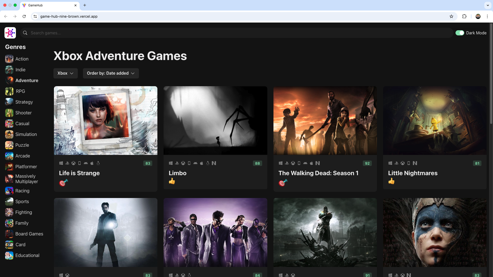

# [Game Hub](https://game-hub-nine-brown.vercel.app/)

**Game Hub** is a responsive React app that fetches game data from the [RAWG](https://rawg.io/apidocs) API. Built with Chakra UI, it supports full-text search, genre/platform filtering, sort options, and dark/light theme switching. It uses a modular component architecture, reusable data-fetching hooks, and performance optimizations like static genre data.

## Tech Stack

- **React 18.0.27**
- **Chakra UI 2.10**
- **TypeScript 4.9.3**
- **Axios 1.8.4**
- **React Icons 4.7.1**
- **RAWG Video Games API**

## App Structure

The app is divided into three main UI areas:

### 1. NavBar

- Contains **icon**, **search bar**, and **mode switch**.
- Search bar uses Chakra's `InputLeftElement` and `useRef` for controlled input.
- `onSearch` is passed to parent via props for triggering new API queries.
- Mode switch uses Chakra's `Switch` + `useColorMode`. Initial theme (`dark`) is set in `theme.ts`.
- Theme customization is done using Chakra’s Smart Swatch and custom theme overrides.

### 2. Sidebar (Genre List)

- Wrapped in Chakra's `Show` to hide on smaller screens.
- Contains a `Heading` and a `List` of genres rendered as clickable `Button`s.
- Clicking a genre sends a new query to the server.

#### Static Genre Data

- Genre categories rarely change, so genre data is stored locally in `data/genres.ts`.
- Fetched via the `useGenres` hook, which internally uses a general-purpose `useData` hook.

## Custom Data Hooks

### `useData(endpoint, requestConfig?, dependencies?)`

A generic data-fetching hook that:

- Uses `useEffect` and Axios to retrieve data.
- Manages three internal states: `data`, `isLoading`, `error`.
- Includes a cleanup function to cancel stale requests if the component unmounts.

### `useGenres`

- Calls `useData`, but returns static genre data from a local file.
- Improves performance by avoiding unnecessary network requests.

### Axios Configuration

- `api-client.ts` creates an `AxiosInstance` with a base URL and API key to centralize API access logic.

## Main Content Area

The main area consists of:

- Game Heading
- Platform Selector
- Sort Selector
- Game Grid

### GameQuery Interface

- Stores current query parameters (`genre`, `platform`, `sortOrder`, `searchText`).
- Maintained as a state in `App.tsx`, and updated via user interaction from various components.

### 1. Game Heading

- Displays currently selected genre and platform from `GameQuery`.

### 2. Platform Selector

- Built with Chakra's `Menu`, `MenuButton`, and `MenuList`.
- Accepts two props: `onSelectPlatform` (handler) and `selectedPlatform` (name string).
- Platform data is also stored locally to reduce network load.

### 3. Sort Selector

- Same structure as Platform Selector.
- Uses a `sortOrders` array containing `{ value, label }` pairs.
  - `value` is the actual sort field (e.g., `-released`)
  - `label` is the human-readable name (e.g., `Release Date Descending`)

### 4. Game Grid

- Uses Chakra's `SimpleGrid` to render a responsive grid of game cards.
- Column count changes based on screen width (1–3+).
- Includes:
  - `GameCardContainer`: wraps the card with layout padding/margins.
  - `GameCardSkeleton`: shows a placeholder while data is loading.
  - `GameCard`: shows full game details (image, title, platforms, rating, emoji)

## GameCard Details

### Game Image

- RAWG API returns high-res images; cropped down using a `cropImage` helper for faster loading.

### Platform Icon List

- Icons mapped via `iconMap` from platform slugs to `react-icons`.

### Critic Score

- Rendered as Chakra `Badge`, colored by score:
  - Green: ≥ 75
  - Yellow: 60–74
  - Red: < 60

### Emoji

- Emoji displayed based on `rating_top` using an `emojiMap`.

## Further Improvements & Limitations

### 1. Prop Drilling

- `onSearch` is passed down multiple layers.
- **Improvement**: use React Context or Zustand for shared state (cleaner and scalable).

### 2. No Reset for Selections

- Once a user selects a genre/platform/sort, there's no way to "undo" or reset to "All".
- **Improvement**: Add a “Clear All Filters” button or allow deselection.

## 📖 Getting Started

### 1. Clone and Install

```bash
git clone https://github.com/yamchips/game-hub.git
cd game-hub
npm install
```

### 2. Add environement variable

Visit RAWG website and get your RAWG API key.

### 3. Run the app

`npm run dev`

## Screenshots


_Figure 1: Genre: Xbox, Order by: date added_
